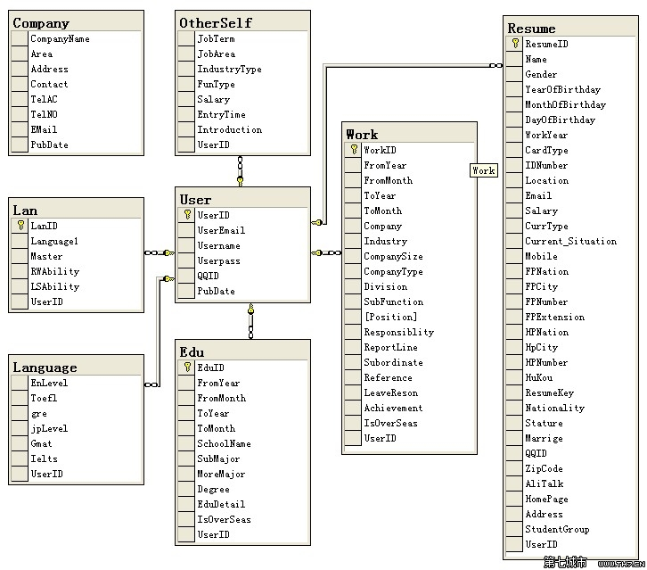

# 绪论

## 课题研究背景与意义

随着计算机和互联网技术的高速发展……

## 国内外研究现状

### 国内A技术与系统

国内A技术与系统……

### 国内B技术与系统

国内B技术与系统……

## 课题来源与研究内容

本课题来源于华中科技大学电子信息与通信学院互联网中心自拟项目……

本课题主要研究以下几个方面的内容：

根据课题要求调研当前XX相关技术和现有的系统或平台……

根据需求分析，设计并实现一个基于B/S架构的Web系统……

## 论文组织结构

本文一共五章，内容安排如下：

第一章为绪论，说明了论文的背景和意义，同时介绍了论文的项目来源，研究内容和章节安排。

第二章是XX系统所使用的核心技术的介绍。

第三章对XX系统进行了整体需求分析和设计。

第四章对核心功能模块进行具体实现描述。

第五章对本论文全部工作进行总结，并对下一步工作提出规划和展望。

# 相关技术介绍

## LAMP架构

LAMP是一种Web网络应用开发环境……

引用\cite{aumann1976agreeing}**【IMPORTANT: 全文必须有至少一处Latex引用命令，否则编译会报错，目前尚无解决方法】**

### Linux操作系统

Linux是一个开源的基于POSIX和UNIX的多用户、多任务、支持多线程和多CPU的操作系统……

### Apache服务器

Apache是Apache软件基金会的一个开源Web服务器……

### MySQL数据库

MySQL是一个属于Oracle公司的关系型数据库管理系统……

### PHP语言

PHP是一种服务器端的通用脚本语言……

PHP具有以下特点：

* 易于学习，快捷开发……
* 开源与跨平台……
* 效率高……
* 有丰富的功能……

## Web前端技术

Web技术是很牛掰很有前途的技术……

### Backbone.js框架

Backbone.js是一款基于Javascript的MVVC框架……

### Node.js

Node.js很火……

### WebRTC技术

WebRTC也很火……

## 本章小结

本章根据系统实现需要，依次简要介绍了各种技术……

# 系统需求分析和总体设计

## 系统需求分析

系统需求分析……

## 系统总体架构

系统形体架构……

## 功能模块设计

## 数据库设计

如图\ref{fig:module}所示，设计出了如下数据库。

## 本章小结

本章分析了需求，设计了系统的总体架构、各个功能模块和数据库……

# 系统的实现与测试

## 模块A的实现

模块A的实现……

## 模块B的实现

模块B的实现……

## 模块C的实现

模块C的实现……

## 系统的部署

系统的部署……

## 系统的测试

### 测试环境

【本表格由[TablesGenerator](http://www.tablesgenerator.com/markdown_tables)生成】

| 环境   | 参数名称  | 参数值                                                |
|--------|-----------|-------------------------------------------------------|
| 客户端 | 机器硬件  | Intel(R) Core(TM) i3-2120 CPU @ 3.30GHZ 4GB RAM       |
|        | 操作系统  | Microsoft Windows 7 X64                               |
|        | 浏览器    | Chrome 40 Firefox 35 IE9/10                           |
| 服务器 | 机器硬件  | Intel(R) Xeon(R) CPU E5-2609 0 @ 2.40GHz * 8 32GB RAM |
|        | 操作系统  | CentOS 6.2 X64                                        |
|        | Web服务器 | Apache 2.2.15, PHP 5.3.3                              |

### 系统功能测试

系统功能测试……

### 系统性能测试

系统性能测试……

## 本章小结

本章根据第三章的设计，实现了XXX系统……

# 总结与展望

## 论文工作总结

本系统做了什么什么工作（把摘要改一下）……

系统主要有以下特点：

* 特点1
* 特点2
* 特点3

## 未来工作展望

系统已实现了XX功能。未来将主要在以下方面继续开展工作：

* 未来工作1
* 未来工作2
* 未来工作3
